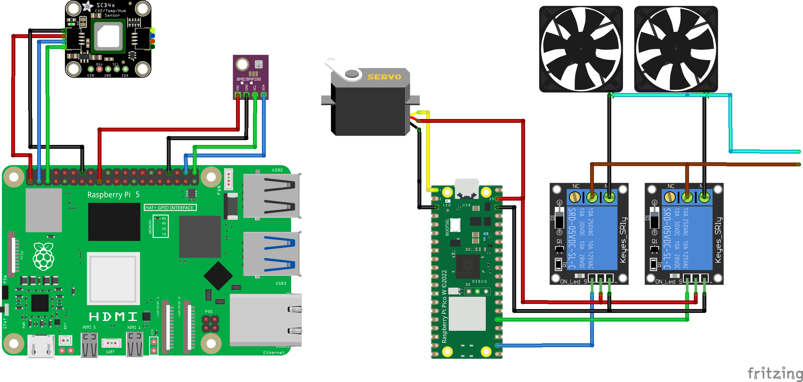

# Adaptive Ventilation System

An intelligent ventilation control system that uses multiple sensors, presence detection, and machine learning to optimize indoor air quality while minimizing energy consumption.

## System Overview

This system consists of:
- **Raspberry Pi 5**: Main controller running Python-based ventilation logic
- **Raspberry Pi Pico W**: Sensor node for environmental monitoring
- **Telegram Bot**: Remote monitoring and control interface
- **Machine Learning**: Markov-based predictive control and occupancy pattern analysis

### System Wiring Diagram



The diagram shows the complete hardware setup including:
- Raspberry Pi 5 as the main controller
- Raspberry Pi Pico W with connected sensors (SCD41 and BMP280)
- Servo motor for ventilation control
- Two cooling fans controlled via relay modules
- All necessary connections and power distribution

## Prerequisites

### Hardware Requirements
- Raspberry Pi 5 with Raspbian OS
- Raspberry Pi Pico W
- SCD41 CO2/Temperature/Humidity sensor
- BMP280 pressure sensor
- Ventilation system with controllable speeds

### Software Dependencies
```bash
# System packages
sudo apt update
sudo apt install python3-pip python3-venv git

# Python dependencies (installed via requirements.txt)
pip install -r requirements.txt
```

## 1. Real System Setup (Raspberry Pi 5)

### Installation

1. **Clone the repository:**
```bash
git clone <repository-url>
cd Thesis/Raspberry_Pi5
```

2. **Create virtual environment:**
```bash
python3 -m venv venv
source venv/bin/activate
```

3. **Install dependencies:**
```bash
pip install -r requirements.txt
```

### Configuration

1. **Environment Variables:**
Create a `.env` file in the `bot/` directory:
```bash
# bot/.env
BOT_TOKEN=your_telegram_bot_token
ADMIN_ID=your_telegram_user_id
PICO_IP=192.168.0.110  # IP of your Pico W
```

2. **System Settings:**
Edit `config/settings.py` to match your setup:
```python
# Sensor configuration
MEASUREMENT_INTERVAL = 120  # seconds between measurements
PICO_IP = "192.168.0.110"   # Your Pico W IP address

# Room settings
DEFAULT_OCCUPANTS = 2
DEFAULT_CO2_THRESHOLD = 1000  # ppm
```

### Autostart Configuration

To automatically start the system on Pi5 boot:

1. **Create systemd service:**
```bash
sudo nano /etc/systemd/system/ventilation.service
```

2. **Service file content:**
```ini
[Unit]
Description=Smart Ventilation System
After=network.target
Wants=network-online.target

[Service]
Type=simple
User=pi
WorkingDirectory=/home/pi/Thesis/Raspberry_Pi5
Environment=PATH=/home/pi/Thesis/Raspberry_Pi5/venv/bin
ExecStart=/home/pi/Thesis/Raspberry_Pi5/venv/bin/python main.py
Restart=always
RestartSec=10
StandardOutput=journal
StandardError=journal

[Install]
WantedBy=multi-user.target
```

3. **Enable and start the service:**
```bash
sudo systemctl daemon-reload
sudo systemctl enable ventilation.service
sudo systemctl start ventilation.service
```

4. **Check service status:**
```bash
sudo systemctl status ventilation.service
sudo journalctl -u ventilation.service -f  # View logs
```

### Manual Operation

For testing or development:
```bash
cd Raspberry_Pi5
source venv/bin/activate
python main.py
```

### Pico W Setup

1. **Flash the Pico W** with the code in `Raspberry_PicoW/main.ino`
2. **Configure WiFi** credentials in the Pico code
3. **Set static IP** to match `PICO_IP` in settings

## 2. Simulation Instructions

The simulation system allows testing different ventilation strategies without physical hardware.

### Quick Start

Navigate to the Pi5 directory:
```bash
cd Raspberry_Pi5
```

### Training Mode

Train the Markov model with extended simulation (recommended first step):
```bash
python train_markov_model.py --duration 90 --output-dir training_results
```

Additional training options:
```bash
# Custom duration and output directory
python train_markov_model.py --duration 180 --output-dir custom_training

# With specific time step
python train_markov_model.py --duration 90 --time-step 10
```

### Evaluation and Comparison

Test all strategies with pre-trained model:
```bash
python run_simulation.py --duration 7 --use-pretrained --strategies all
```

Compare specific strategies:
```bash
python run_simulation.py --duration 14 --strategies threshold markov interval --use-pretrained
```

Fair comparison with shared occupant behavior:
```bash
python run_simulation.py --compare-fair --strategies threshold markov interval --duration 7
```

Compare existing simulation results:
```bash
python run_simulation.py --compare-only --config comparison_config.json
```

### Available Strategies

- **threshold**: CO2 threshold-based control
- **constant**: Constant low ventilation
- **scheduled**: Time-based scheduled ventilation
- **interval**: Regular interval ventilation (10 min every hour)
- **markov**: Machine learning-based control
- **predictive**: Occupancy prediction-based control (requires real components)

### Simulation Options

```bash
# Duration control
--duration 14           # Simulation length in days

# Strategy selection
--strategies all         # All available strategies
--strategies threshold markov  # Specific strategies

# Comparison modes
--compare-fair          # Fair comparison with shared occupant behavior
--compare-only          # Compare existing results without new runs

# Model options
--use-pretrained        # Use pre-trained Markov model
--training-mode         # Higher exploration rate for training
```

## System Components

### Core Modules

- **`main.py`**: Main application entry point
- **`sensors/`**: Sensor data collection and management
- **`control/`**: Ventilation control algorithms
- **`presence/`**: Occupancy detection and device management
- **`predictive/`**: Machine learning and pattern analysis
- **`preferences/`**: User preference management
- **`bot/`**: Telegram bot interface
- **`simulation/`**: Virtual environment for testing

### Data Storage

- **`data/csv/`**: Sensor measurement logs
- **`data/occupancy_history/`**: Occupancy patterns and probabilities
- **`data/preferences/`**: User preference settings
- **`simulation_results/`**: Simulation outputs and comparisons

## Monitoring and Control

### Telegram Bot Commands

- `/status` - System status and current readings
- `/ventilation` - Control ventilation speed
- `/preferences` - Manage user preferences
- `/occupancy` - View occupancy patterns
- `/sleep` - Sleep pattern analysis

### Log Files

- **`ventilation.log`**: Main system log
- **`simulation_results/*/simulation.log`**: Simulation-specific logs

## Troubleshooting

### Common Issues

1. **Service won't start:**
   - Check file permissions: `sudo chown -R pi:pi /home/pi/Thesis`
   - Verify Python path in service file
   - Check logs: `sudo journalctl -u ventilation.service`

2. **Sensor connection issues:**
   - Verify Pico W IP address in settings
   - Check network connectivity: `ping 192.168.0.110`
   - Ensure sensors are properly connected to Pico

3. **Bot not responding:**
   - Verify BOT_TOKEN in `.env` file
   - Check ADMIN_ID is correctly set
   - Ensure bot has been started with `/start` command

### Performance Optimization

- Adjust `MEASUREMENT_INTERVAL` based on your needs (60-300 seconds)
- Enable `SKIP_INITIALIZATION` for faster startup
- Use `night_mode` settings to reduce activity during sleep hours

## Development

### Testing

Run the test suite:
```bash
cd tests/
python -m pytest
```

### Adding New Strategies

1. Implement strategy in `control/` module
2. Add strategy enum to `simulation/ventilation.py`
3. Update simulation scripts to include new strategy

## License

This project is licensed for educational purposes only.
